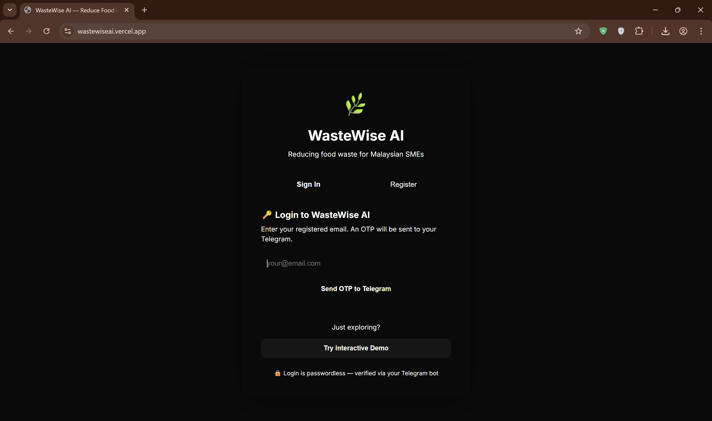
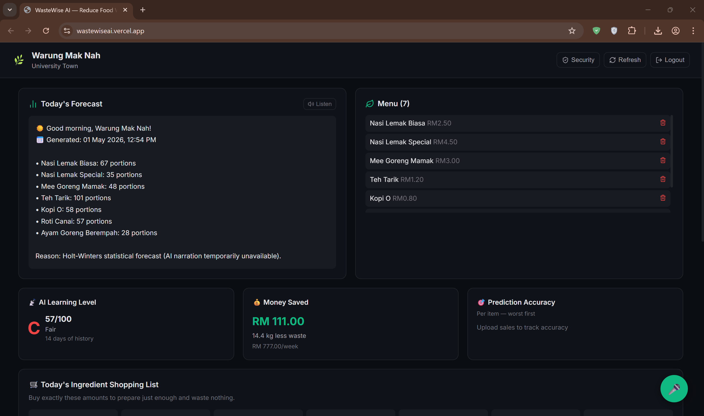
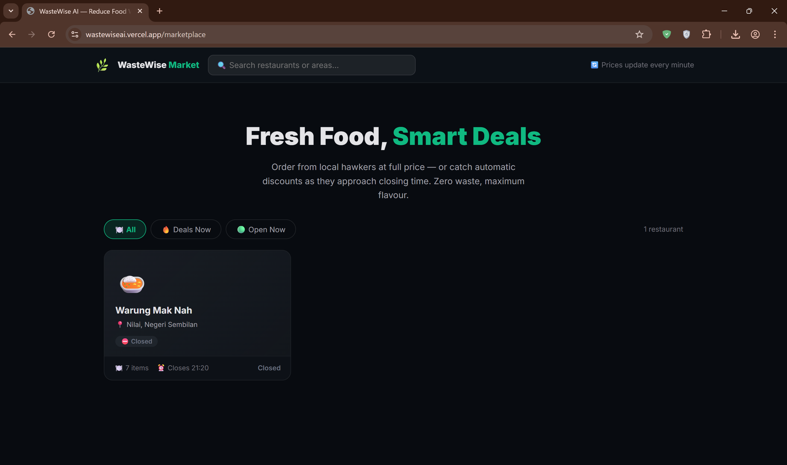

# 🌿 WasteWise AI

> **Autonomous AI platform that eliminates food waste for Malaysian hawker stalls — all through Telegram.**

[](https://fastapi.tiangolo.com)
[](https://nextjs.org)
[](https://python.org)
[](https://supabase.com)
[](LICENSE)

**[Live Demo](https://wastewiseai.vercel.app)** · **[GitHub](https://github.com/meel-ayush/WasteWise-AI)** · **[LinkedIn](https://www.linkedin.com/in/ayushmeel)**

---

## 📌 Table of Contents

1. [The Problem](#-the-problem)
2. [My Solution](#-my-solution)
3. [Screenshots](#-screenshots)
4. [Architecture](#-architecture)
5. [Features](#-features)
6. [Tech Stack](#-tech-stack)
7. [Project Structure](#-project-structure)
8. [Getting Started](#-getting-started)
9. [Deployment](#-deployment)
10. [Free-Tier Notes](#-free-tier-notes)
11. [Work in Progress](#-work-in-progress)
12. [Challenges](#-challenges)
13. [What I Learned](#-what-i-learned)
14. [Future Goals](#-future-goals)
15. [License](#-license)

---

## 🚨 The Problem

Malaysia generates **RM 16.9 billion** in food waste annually. A large portion comes from hawker stalls — small food vendors who manually estimate daily prep quantities with zero data. When rain reduces foot traffic, prayer times create demand lulls, or a public holiday shifts buying patterns, hawkers only find out when food is already wasted at closing time.

No existing tool was built for someone too busy cooking to open a dashboard.

---

## 💡 My Solution

WasteWise AI meets hawkers where they already are — **Telegram**. One daily message ("sold 30 nasi lemak today") triggers everything else autonomously:

- **Learns** sales patterns with Holt-Winters ML forecasting
- **Forecasts** tomorrow's demand per item, up to 95% accuracy
- **Adjusts prices autonomously** every 15 minutes based on real-time weather, prayer times, inventory pressure, and time-to-closing — no human input needed
- **Lists excess stock** on a public customer marketplace, turning closing waste into revenue
- **Communicates** in Bahasa Melayu, English, Mandarin, or Tamil — auto-detected per user

The dashboard provides deeper analytics for owners who want them. The core loop runs entirely through Telegram.

---

## 📸 Screenshots

### Login

*Multi-step OTP authentication with GDPR cookie consent — no passwords stored*

### Dashboard

*Daily waste metrics, demand forecasts, AI Insights with causal root-cause analysis, BCG menu matrix, and voice TTS readout*

### Marketplace

*Public-facing storefront with urgency badges, multi-restaurant cart, and real-time order tracking*

---

## 🏗️ Architecture

```
┌─────────────────────────────────────────────────────────┐
│                HAWKER  (Telegram Bot)                    │
│    Daily log → NLP intent parse → AI learns → Forecast  │
└──────────────────────┬──────────────────────────────────┘
                       │  webhook
┌──────────────────────▼──────────────────────────────────┐
│           FastAPI Backend  (Python 3.12 · Uvicorn)       │
│                                                          │
│   NLP Engine (20+ intents)  ·  Autonomous Pricing Agent  │
│   Scheduler (6 background jobs)  ·  Security Layer       │
│   Causal AI  ·  Menu Engineering  ·  Marketplace         │
└──────┬──────────────────────────────────────┬───────────┘
       │                                      │
┌──────▼──────────┐                ┌──────────▼──────────┐
│  Supabase       │                │  Redis  (Upstash)   │
│  PostgreSQL     │◄──────────────►│  1h TTL cache       │
│  8 tables       │                │  in-memory fallback │
│  + local JSON   │                └─────────────────────┘
│  fallback       │
└──────┬──────────┘
       │
┌──────▼──────────────────────────────────────────────────┐
│  AI Fallback Chain — never fails on a single outage      │
│  Gemini 1.5 Flash  →  Groq  →  Mistral                  │
└─────────────────────────────────────────────────────────┘

┌─────────────────────────────────────────────────────────┐
│          Next.js 15 Dashboard  (TypeScript)              │
│  Upload · Events · Profit · Marketplace · Insights · CV  │
└─────────────────────────────────────────────────────────┘
```

---

## ✨ Features

Features are split by where they are accessible today.

### ✅ Live in Dashboard + Telegram

| Feature | Detail |
|---|---|
| 🤖 **Demand Forecasting** | Holt-Winters + ensemble ML, up to 95% accuracy, weekly auto-retraining |
| ⚡ **Autonomous Pricing Agent** | Runs every 15 min (6 AM–11 PM) — adjusts discounts from 10 factors: weather, prayer times, inventory, closing urgency, day-of-week, events, and more |
| 🛒 **Closing Stock Marketplace** | Customers browse discounted items → order → Telegram alert to hawker → 45-min pickup window |
| 📦 **Daily Order Numbers** | Each order gets a short daily #N reset at midnight — hawker replies `done 3` or `miss 3` instead of long order IDs |
| 📊 **Orders Dashboard Panel** | Real-time view of today's pending/completed/cancelled orders with status controls |
| 🔗 **Chain Management Panel** | Create chains, add/remove branches, push menu templates — with Telegram primary approval for destructive actions |
| 🔬 **Causal AI Root-Cause** | SCM + ITS + Bayesian ATT explains *why* yesterday underperformed (rain / day-of-week / events / unexplained residual) |
| 📊 **BCG Menu Engineering** | Stars / Ploughhorses / Puzzles / Dogs matrix with HHI concentration and cannibalization detection |
| 📷 **Computer Vision Inventory** | Upload a shelf photo — Gemini Vision + EasyOCR detects ingredients and cross-references your BOM |
| 🧾 **Shopping List** | Auto-generated daily from tomorrow's forecast — shows exactly what to buy and how much |
| 🔊 **Voice TTS Insights** | Reads causal + menu analysis aloud via Web Speech API. No library or API key needed |
| 🧠 **Multi-Intent NLP** | One Telegram message can contain multiple commands — all executed in a single reply |
| 🗓️ **Event Registration** | Log upcoming events (festivals, market days) so the AI adjusts forecasts proactively |

### 🔐 Security & Administration

| Feature | Detail |
|---|---|
| 🔑 **Primary Account Model** | One Telegram account is designated Primary per restaurant — only they can approve destructive actions |
| 📱 **Inline Session Management** | Telegram bot shows all logged-in devices with ⭐ Make Primary and 🗑 Remove buttons — no manual typing required |
| ✅ **Dashboard Action Approval** | Delete restaurant, delete chain, create chain, add/remove branch — all require Primary Telegram confirmation |
| 🛡️ **OTP Rate Limiting** | Failed OTP attempts are tracked and blocked — no brute-force possible |
| 🔒 **Input Sanitisation** | All user inputs validated + sanitised before DB writes — prevents injection attacks |
| 📝 **Full Audit Trail** | Every write operation logged with timestamp, email, endpoint, and IP address |

### ⚙️ Live in Telegram Bot Only *(no dashboard UI yet — see [Work in Progress](#-work-in-progress))*

| Feature | Detail |
|---|---|
| 🎮 **Gamification** | Streaks, badges, accuracy milestones sent via Telegram after each daily log |
| 🏆 **Regional Leaderboard** | Anonymous weekly waste-reduction ranking among hawkers in the same region |
| 🌿 **Sustainability Tracking** | CO₂ saved counter, monthly environmental report, tree-equivalent calculation |
| 🧬 **Federated Learning** | 2-layer MLP + FedAvg + Laplace DP — model improves across restaurants without sharing raw data |
| 🧾 **BOM Detail Editor** | Full bill-of-materials with ingredient costs and supplier notes — managed via bot commands |

---

## 🛠️ Tech Stack

**Backend** — Python 3.12 · FastAPI · Uvicorn · Supabase (PostgreSQL) · Redis (Upstash) · Celery / APScheduler · python-jose (JWT HS256) · python-telegram-bot · Gemini 1.5 Flash / Groq / Mistral · scikit-learn · NumPy · EasyOCR · Pillow · SlowAPI · Open-Meteo · Aladhan · LocationIQ / Nominatim

**Frontend** — Next.js 15 (App Router) · TypeScript · React hooks · Web Speech API (TTS + voice input) · Cookie (30-day, SameSite=Lax) + sessionStorage fallback

---

## 📁 Project Structure

```
WasteWise-AI/
│
├── README.md                            ← This file
├── LICENSE                              ← CC BY-NC 4.0
├── docs/
│   └── supabase_schema.sql              ← Full PostgreSQL schema — run once in Supabase SQL Editor
│
├── screenshots/
│   ├── login.png                        ← Login / OTP authentication page
│   ├── dashboard.png                    ← Owner analytics dashboard
│   └── marketplace.png                  ← Public customer marketplace
│
├── backend/                             ← FastAPI server — deploy to Hugging Face
│   ├── main.py                          ← App entry point — 50+ API routes (enterprise-hardened)
│   ├── Dockerfile                       ← Container config for Hugging Face Spaces (port 7860)
│   ├── requirements.txt                 ← All Python dependencies (pinned versions)
│   ├── .env.example                     ← Template for every environment variable
│   ├── keygen.py                        ← Run once to generate SECRET_KEY for JWT signing
│   └── services/
│       ├── ai_provider.py               ← Gemini → Groq → Mistral 3-tier fallback chain
│       ├── audit.py                     ← Request / response audit middleware
│       ├── auth.py                      ← OTP issuance, session management, primary account logic
│       ├── bom_ai.py                    ← Bill-of-Materials AI generator
│       ├── cache.py                     ← In-memory dict cache (Redis fallback)
│       ├── cache_layer.py               ← Unified Redis ↔ memory cache interface
│       ├── causal_ai.py                 ← SCM + ITS + Bayesian ATT causal inference engine
│       ├── chain_management.py          ← Multi-branch chain creation, analytics, transfer logic
│       ├── computer_vision_inventory.py ← Gemini Vision + EasyOCR shelf-photo scanning
│       ├── data_miner.py                ← Holt-Winters forecasting, waste metrics, BOM
│       ├── email_service.py             ← Resend transactional email for OTP delivery
│       ├── federated_learning.py        ← 2-layer MLP + FedAvg + Laplace differential privacy
│       ├── file_processor.py            ← PDF / DOCX / XLSX upload and text extraction
│       ├── gamification.py              ← Streak tracking, badges, regional leaderboard logic
│       ├── inventory.py                 ← Marketplace listings, surge pricing, order lifecycle
│       ├── location_intel.py            ← Geocoding, foot-traffic analysis, weather fetch
│       ├── marketplace_auth.py          ← Customer-facing OTP auth for order tracking
│       ├── menu_engineering.py          ← BCG matrix, HHI, cannibalization detection
│       ├── migrations.py                ← Database schema migration runner
│       ├── nlp.py                       ← Multi-intent NLP engine, 20+ intents, 4 languages
│       ├── pricing_agent.py             ← Autonomous 15-min pricing intelligence agent
│       ├── scheduler.py                 ← 6 background jobs (closing alerts, pricing, autotuning)
│       ├── security.py                  ← Auth guards, IDOR prevention, rate limiting
│       ├── storage_service.py           ← Supabase Storage / S3 bucket manager
│       ├── supabase_db.py               ← Supabase + local JSON hybrid DB layer
│       ├── sustainability.py            ← Carbon footprint scoring, CO₂ equivalence
│       ├── task_queue.py                ← Celery / APScheduler task dispatcher
│       ├── telegram_bot.py              ← Complete Telegram bot handler (inline buttons, NLP, security UI)
│       └── __init__.py                  ← Services package init
│
└── dashboard/                           ← Next.js 15 frontend — deploy to Vercel
    ├── package.json                     ← Node.js dependencies and scripts
    ├── next.config.ts                   ← Next.js configuration
    ├── tsconfig.json                    ← TypeScript compiler options
    ├── postcss.config.mjs               ← PostCSS config
    ├── next-env.d.ts                    ← Next.js TypeScript declarations
    └── src/app/
        ├── globals.css                  ← Global CSS styles
        ├── layout.tsx                   ← Root layout with metadata
        ├── page.tsx                     ← Entry point — auth routing + 30-day cookie session
        ├── components/
        │   ├── AuthScreen.tsx           ← Login / register screen toggle wrapper
        │   ├── ChainsPanel.tsx          ← Chain management panel (create, view, manage branches)
        │   ├── Dashboard.tsx            ← Main owner dashboard — all tabs including Orders & Chains
        │   ├── FileIntentModal.tsx      ← Modal to choose intent after file upload
        │   ├── LoginFlow.tsx            ← Email OTP login flow
        │   ├── Modal.tsx                ← Reusable modal component
        │   ├── OrdersPanel.tsx          ← Real-time orders panel with status management
        │   ├── ProfitTab.tsx            ← Sales & profit breakdown tab
        │   ├── RegisterFlow.tsx         ← Multi-step registration with admin approval
        │   ├── StoreSettings.tsx        ← Marketplace listings, closing time, item photos
        │   └── VoicePanel.tsx           ← Floating voice input + TTS panel (Web Speech API)
        ├── customer/
        │   └── page.tsx                 ← Customer-facing order tracking page
        └── marketplace/
            └── page.tsx                 ← Public marketplace storefront
```

---

## 🚀 Getting Started

### Prerequisites

- Python 3.12+ · Node.js 18+ · Git
- Free accounts at: [Supabase](https://supabase.com) · [Telegram](https://t.me/BotFather) · [Google AI Studio](https://aistudio.google.com)

---

### Step 1 — Clone

```bash
git clone https://github.com/meel-ayush/WasteWise-AI.git
cd WasteWise-AI
```

---

### Step 2 — Set Up the Database

1. [supabase.com](https://supabase.com) → **New Project** → name `wastewise`, region: Singapore.
2. **SQL Editor** → paste contents of `docs/supabase_schema.sql` → **Run**.
3. **Settings → API** → copy:
   - **Project URL** → `SUPABASE_URL`
   - **`service_role` key** → `SUPABASE_SERVICE_KEY`

> ⚠️ The `service_role` key has full database access. Never put it in the frontend or commit it to Git.

---

### Step 3 — Obtain All API Keys

| Variable | Where to get it | Required? |
|---|---|:---:|
| `SECRET_KEY` | `cd backend && python keygen.py` — copy the output | ✅ |
| `TELEGRAM_TOKEN` | [@BotFather](https://t.me/BotFather) → `/newbot` → copy token | ✅ |
| `GEMINI_API_KEY` | [aistudio.google.com](https://aistudio.google.com) → **Get API Key** | ✅ |
| `SUPABASE_URL` | Supabase → **Settings → API** | ✅ |
| `SUPABASE_SERVICE_KEY` | Supabase → **Settings → API** → `service_role` | ✅ |
| `GROQ_API_KEY` | [console.groq.com](https://console.groq.com) → **API Keys** | Recommended |
| `MISTRAL_API_KEY` | [console.mistral.ai](https://console.mistral.ai) → **API Keys** | Recommended |
| `RESEND_API_KEY` | [resend.com](https://resend.com) → **API Keys** | Recommended |
| `REDIS_URL` | [upstash.com](https://upstash.com) → **Create Database** → copy URL | Optional |
| `LOCATIONIQ_API_KEY` | [locationiq.com](https://locationiq.com) → **Access Tokens** | Optional |
| `GEOAPIFY_API_KEY` | [geoapify.com](https://geoapify.com) → **Projects** → **API Key** | Optional |

All optional keys have free-tier fallbacks built into the app — the system will run without them.

---

### Step 4 — Configure Environment Variables

```bash
cd backend
cp .env.example .env
# Open .env and fill in your keys
```

```env
# ── MANDATORY ──────────────────────────────────────────────────
SECRET_KEY=            # output of: python keygen.py
TELEGRAM_TOKEN=        # from @BotFather
GEMINI_API_KEY=        # from aistudio.google.com
SUPABASE_URL=          # from Supabase → Settings → API
SUPABASE_SERVICE_KEY=  # service_role key from Supabase

# ── RECOMMENDED ────────────────────────────────────────────────
GROQ_API_KEY=          # AI fallback tier 2 (Groq)
MISTRAL_API_KEY=       # AI fallback tier 3 (Mistral)
RESEND_API_KEY=        # email OTP delivery
FROM_EMAIL=            # verified sender address for Resend

# ── OPTIONAL (app runs without these) ──────────────────────────
DATABASE_URL=          # Supabase direct Postgres connection string
REDIS_URL=             # Upstash Redis URL — falls back to in-memory
CELERY_BROKER_URL=     # same Upstash URL, use /0 suffix
CELERY_RESULT_BACKEND= # same Upstash URL, use /0 suffix
LOCATIONIQ_API_KEY=    # precision geocoding — falls back to Nominatim
GEOAPIFY_API_KEY=      # address autocomplete
ALLOWED_ORIGINS=       # comma-separated CORS origins
BOT_USERNAME=          # Telegram bot @username (without @)
ADMIN_EMAIL=           # admin account for federated learning trigger
```

**Frontend:**

```bash
cd dashboard
echo "NEXT_PUBLIC_API_URL=http://localhost:8000" > .env.local
# Replace with your Hugging Face URL for production
```

---

### Step 5 — Run Locally

```bash
# Terminal 1 — Backend
cd backend
pip install -r requirements.txt
uvicorn main:app --reload --port 8000
# Interactive API docs → http://localhost:8000/docs

# Terminal 2 — Frontend
cd dashboard
npm install
npm run dev
# Dashboard → http://localhost:3000
```

**Register the Telegram webhook** (run once, after backend is publicly accessible):

```bash
curl "https://YOUR_BACKEND_URL.hf.space/api/set_webhook"
```

---

## 🌐 Deployment

### Backend → Hugging Face Spaces

1. [huggingface.co](https://huggingface.co) → **Spaces → New Space** → SDK: **Docker** → name: `wastewise-backend`.
2. Push only the `backend/` folder to the Space:
   ```bash
   git remote add hf https://huggingface.co/spaces/YOUR_HF_USERNAME/wastewise-backend
   git subtree push --prefix backend hf main
   ```
3. **Settings → Variables and secrets** → add every key from your `.env`.
4. Hugging Face reads the `Dockerfile` and starts Uvicorn on port 7860 automatically.
5. Register the Telegram webhook once your Space is live:
   ```
   https://YOUR_HF_USERNAME-wastewise-backend.hf.space/api/set_webhook
   ```

### Frontend → Vercel

1. Push the full repo (or `dashboard/` folder) to GitHub.
2. [vercel.com](https://vercel.com) → **New Project** → import repo → set **Root Directory** to `dashboard`.
3. Add environment variable:
   ```
   NEXT_PUBLIC_API_URL = https://YOUR_HF_USERNAME-wastewise-backend.hf.space
   ```
4. Click **Deploy** — Vercel auto-detects Next.js, no further config needed.

### Keep-Alive *(prevents free-tier sleep)*

Hugging Face Spaces sleep after **48 hours** of inactivity. Supabase pauses after **7 days**. One cron job solves both:

1. [cron-job.org](https://cron-job.org) → **Create Cronjob**
2. URL: `https://YOUR_HF_USERNAME-wastewise-backend.hf.space/api/health`
3. Schedule: `0 */12 * * *` (every 12 hours)

The `/api/health` endpoint runs a lightweight Supabase query on every call — one monitor keeps both services alive simultaneously.

---

## ⚠️ Free-Tier Notes

| Service | Limitation | Fix |
|---|---|---|
| **Supabase** | Pauses after 7 days inactive | Keep-alive cron above |
| **Hugging Face** | Sleeps after 48 h inactive | Same keep-alive cron |
| **Upstash Redis** | Free plan: database `/0` only | Use `/0` suffix on all three Redis vars |
| **Gemini** | 15 req/min · 1,500/day | Built-in 3-tier AI fallback |
| **Resend** | 100 emails/day · 3,000/month | Only for OTP — unlikely to hit limit |
| **LocationIQ** | 5,000 req/day | Auto-fallback to Nominatim (no key needed) |

---

## 🚧 Work in Progress

The features below are **fully implemented in the backend and Telegram bot** but do not yet have a dashboard UI. They work today — just not from the web interface.

| Feature | Current Access | Status |
|---|---|---|
| 🎮 **Gamification** — streaks, badges, accuracy milestones | Telegram bot — delivered after each daily log | Dashboard widget coming |
| 🏆 **Regional Leaderboard** — anonymous weekly waste-reduction ranking | Telegram bot — sent in Sunday briefing; requires 5+ restaurants in same region | Dashboard page coming |
| 🌿 **Sustainability Tracking** — CO₂ saved, monthly environmental report, tree equivalent | Telegram bot — monthly summary message | Dashboard tab coming |
| 🧬 **Federated Learning** — model improvement across restaurants with differential privacy | Admin API endpoint (`POST /api/admin/federated_round`) | Automated scheduling coming |
| 🧾 **BOM Detail Editor** — full bill of materials with ingredient costs and supplier notes | Telegram bot commands + API | Dashboard UI coming |

---

## 🧗 Challenges

- **Making the AI act, not just recommend.** The pricing agent applies real discounts autonomously. Earning user trust required anti-thrash cooldowns, conservative multi-signal thresholds, and Telegram notifications that kept owners in the loop without overwhelming them.
- **Designing for non-tech users.** The entire AI loop — forecasts, pricing, orders, analytics — had to work through a single Telegram message. This drove the NLP architecture toward multi-intent parsing, code-switching tolerance, and 4-language auto-detection.
- **Zero-downtime on free infrastructure.** Hugging Face, Supabase, and Upstash each have different inactivity thresholds. Designing one `/api/health` endpoint that exercises all three dependencies on every call was the cleanest single-monitor solution.
- **Combining 10 live signals without rules spaghetti.** Serializing weather, prayer times, inventory pressure, closing urgency, and historical rain impact as structured LLM context — then validating the JSON decision output before applying it — was cleaner than any rule-based approach.
- **IDOR prevention as a first-class concern.** Retrofitting `require_restaurant_access()` across 19 endpoints after the fact was costly. It's now the first thing I design in any multi-tenant system.

---

## 📚 What I Learned

- **LLMs as decision engines.** The pricing agent produces structured JSON that modifies real database values — not text. The interesting engineering is the loop around the call: validation, fallback, audit, and rollback.
- **Product constraints drive architecture.** "Telegram-only primary interface" forced better decisions than a generic dashboard would have. Constraints clarify what actually matters.
- **Causal inference makes analytics actionable.** "Sales dropped 18% because of rain (p < 0.05), only −2% unexplained" is a decision. "Sales dropped 18%" is noise.
- **Free infrastructure is viable if you design for failure.** Every dependency — DB, cache, AI, geocoding — has a fallback. Resilience is a design layer, not an afterthought.
- **Free tiers have hidden rules.** Upstash's database-0-only restriction, HF's 48-hour sleep, Supabase's 7-day pause — none are prominently documented. Budget time to discover them before choosing your stack.

---

## 🔭 Future Goals

- [ ] **WhatsApp Business API** — second primary interface alongside Telegram
- [ ] **Dashboard UI for all Work-in-Progress features** — gamification, leaderboard, chain management, sustainability, BOM editor
- [ ] **PWA + offline mode** — log sales without internet, sync on reconnect
- [ ] **Integrated payment gateway** — direct checkout in marketplace, no redirect
- [ ] **Voice-first mobile UX** — speak to log, hear the forecast back
- [ ] **Telegram Mini App** — native card UI within Telegram on iOS and Android

---

## 🌐 APIs & Services

| Service | Purpose | Key needed? |
|---|---|:---:|
| [Supabase](https://supabase.com) | PostgreSQL database + Auth + File Storage | ✅ Free |
| [Telegram Bot API](https://core.telegram.org/bots/api) | Primary hawker interface | ✅ Free |
| [Gemini 1.5 Flash](https://aistudio.google.com) | Primary AI model | ✅ Free |
| [Groq](https://console.groq.com) | AI fallback tier 2 | ✅ Free |
| [Mistral](https://console.mistral.ai) | AI fallback tier 3 | ✅ Free |
| [Resend](https://resend.com) | Transactional email OTP | ✅ Free |
| [Upstash](https://upstash.com) | Redis cache | ✅ Free |
| [Open-Meteo](https://open-meteo.com) | Real-time weather + 2-hour forecast | ❌ No key |
| [Aladhan](https://aladhan.com) | Malaysian prayer times | ❌ No key |
| [Nominatim](https://nominatim.openstreetmap.org) | Geocoding fallback (OpenStreetMap) | ❌ No key |
| [LocationIQ](https://locationiq.com) | Precision geocoding (5,000 req/day free) | ✅ Free |
| [Geoapify](https://geoapify.com) | Address autocomplete (3,000 req/day free) | ✅ Free |
| [cron-job.org](https://cron-job.org) | Keep-alive uptime monitor | ❌ No key |

> Every service above has a free tier sufficient for a full production deployment.

---

## 📄 License

Licensed under **Creative Commons Attribution-NonCommercial 4.0 International (CC BY-NC 4.0)**.

Free to share and adapt for non-commercial use with attribution. Commercial use requires a separate license — contact via [LinkedIn](https://www.linkedin.com/in/ayushmeel).

Full terms: [LICENSE](LICENSE) · [CC BY-NC 4.0 Legal Code](https://creativecommons.org/licenses/by-nc/4.0/legalcode)

---

## 👤 Author

**Ayush Meel**

[](https://github.com/meel-ayush)
[](https://www.linkedin.com/in/ayushmeel)

---

*Built to make Malaysian food culture more sustainable, one portion at a time.*
